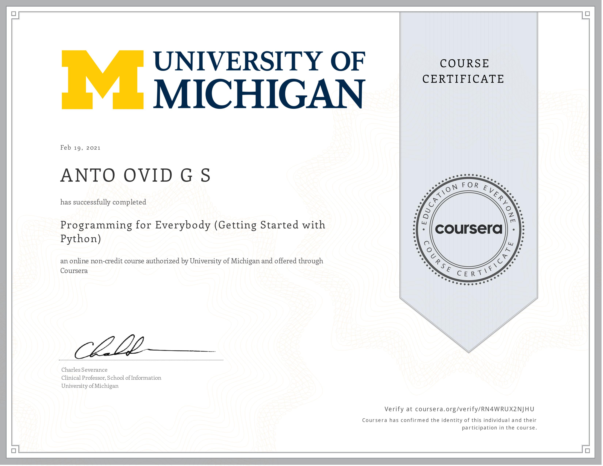

# Programming-for-Everybody-Getting-Started-with-Python ~ University of Michigan

## Week 3:
### Programming Exercises
- [Assignment 1](assignment/Week3-Assignment-Write-hello-world.txt)

## Week 4:
### Programming Exercises
- [Assignment 2.2](assignment/Week4-Assignment_2.2.txt)
- [Assignment 2.3](assignment/Week4-Assignment_2.3.txt)

## Week 5:
### Programming Exercises
- [Assignment 3.1](assignment/Week5-Assignment _3.1.txt)
- [Assignment 3.1](assignment/Week5-Assignment _3.3.txt)

## Week 6:
### Programming Exercises
- [Assignment 4.6](assignment/Week6-Assignment_4.6.txt)

## Week 7:
### Programming Exercises
- [Assignment 5](assignment/Week7-Assignment_5.2.txt)

## 🎓 [Certificate]()

